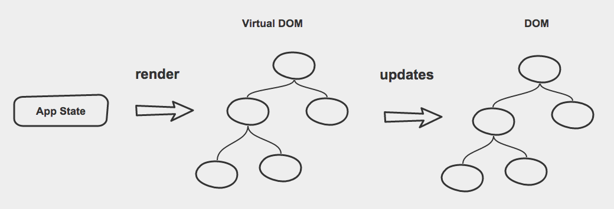
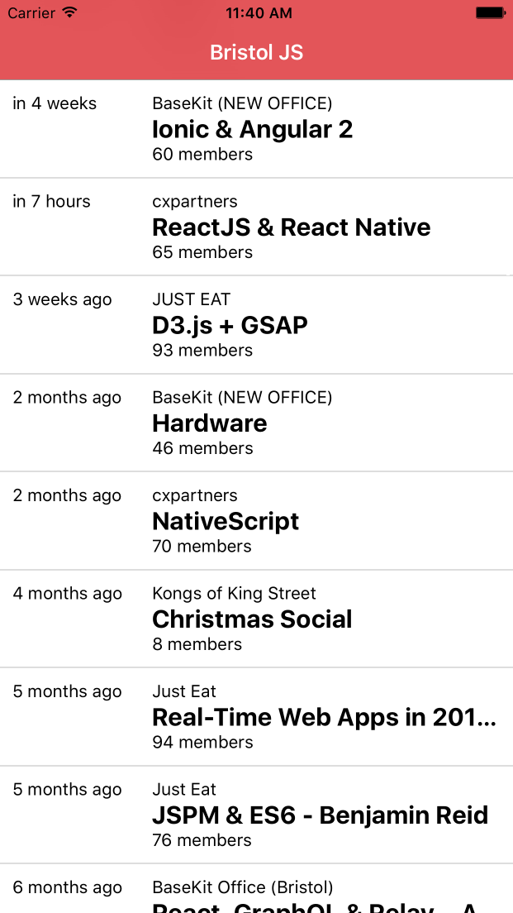

layout: true
class: center

---
# Notes to self ...

Demo setup
1. Ensure that the Meetup app is running
2. Have the Chrome debugger started
3. Ensure Live Reload and HMR are disabled!!


---

class: middle, chapter

# (Geeking out about) React Native

Colin Eberhardt, Scott Logic Ltd. - @ColinEberhardt

BristolJS, April 2016

---
class: middle, chapter

# Why React Native?

---
class: middle


http://www.slideshare.net/appcelerator/appcelerator-html5-prezfinal

---
class: middle


Mobile Web, Wrapper, Native, Hybrid, yadda yadda ...

---
# HTML-UI

- PhoneGap (Cordova)
- Ionic
- Famo.us
- Kendo
- Sencha Touch
- Lungo
- Enyo

---
# Native-UI

- Air (ActionScript)
- Titanium (JS)
- Xamarin (C#)
- Delphi (Object Pascal)
- ReactNative (JS)

---
#Why React Native?

- Not necessarily the best, but the most cool!
- JavaScript
 - Productivity
 - Elegance
 - Innovation
- React
 - Hot Reload
 - Redux, Time Travel
 - ES2015 / Babel

---
class: middle, chapter

# How does it work?

---
class: middle

#Vanilla-JS

---
class: middle

<div id='jquery-demo' class='click-counter'>
  <button class='counting-button'>
    You have clicked me <span class='click-count'></span> times!
  </button>
</div>

---

```html
<div id='jquery-demo' class='click-counter'>
  <button class='counting-button'>
    You have clicked me <span class='click-count'/> times!
  </button>
</div>
```

```javascript
var button = $('.counting-button');
var clickCountText = $('.click-count');

var numberOfClicks = 0;
var tooManyClicks = false;

function updateUI() {
  clickCountText.text(numberOfClicks);
  button.toggleClass('warning', tooManyClicks);
}

button.click(function() {
  numberOfClicks ++;
  tooManyClicks = numberOfClicks > 5;
  updateUI();
});

updateUI();
```

---

class: image, vertical-center


---
class: vertical-center

#Knockout

---
class: vertical-center

<div id='knockout-demo' class='click-counter'>
  <button data-bind="click: buttonClicked, css: { warning: numberOfClicks() > 5 }">
    You have clicked me <span data-bind="text: numberOfClicks"></span> times!
  </button>
</div>

---

```html
<div id='knockout-demo' class='click-counter'>
  <button data-bind="click: buttonClicked,
                     css: { warning: numberOfClicks() > 5 }">
    You have clicked me
      <span data-bind="text: numberOfClicks"></span> times!
  </button>
</div>
```

```javascript
var ClickCounterViewModel = function() {
  this.numberOfClicks = ko.observable(0);

  this.buttonClicked = function() {
    this.numberOfClicks(this.numberOfClicks() + 1);
  }
}

ko.applyBindings(new ClickCounterViewModel(),
  document.getElementById('knockout-demo'));
```

---

class: image, vertical-center


---
class: image, vertical-center


---

#Knockout


- Clumsy property syntax

--
```javascript
this.numberOfClicks = this.numberOfClicks + 1;
```
--
```javascript
this.numberOfClicks(this.numberOfClicks() + 1);
```
--
- Observable arrays

--
- Templating / binding mini-language

--
- Separation of concerns

--
 - ... really?

---
class: vertical-center

#ReactJS

---
class: vertical-center

<div id='react-demo'></div>

---

```html
<div id='react-demo'></div>
```
```javascript
class ClickCounter extends React.Component {
  constructor() {
    super();
    this.state = { numberOfClicks: 0 };
  }

  buttonClicked() {
    this.setState({ numberOfClicks: this.state.numberOfClicks + 1 });
  }

  render() {
    buttonStyle.backgroundColor =
      this.state.numberOfClicks > 5 ? '#ed5f98' : '#9ccc65';

    return (
      <button onClick={this.buttonClicked.bind(this)} style={buttonStyle}>
        You have clicked me {this.state.numberOfClicks} times
      </button>
    );
  }
}

ReactDOM.render(<ClickCounter />, document.getElementById('react-demo'));
```

---

#ReactJS

- View is a transformation of the current state

--
- Virtual DOM / diff

--
- Separation of concerns (not technologies)

--
- Inline styles are arguably a good thing
  - "CSS in your JS" - [Christopher Chedeau](https://vimeo.com/116209150)

--
- Performance?
 - Is ReactJS Fast? - [Boris Dinkevich](http://blog.500tech.com/is-reactjs-fast/)

---
class: vertical-center, image


---
class: vertical-center, image



<!-- https://sketchboard.me/jzBb9OmZopSV -->

---
class: vertical-center

unidirectional data-flows are simple

---
class: middle, chapter

# What is cool about React is the concept, not the implementation

---

class: vertical-center

> If the DOM is decoupled, perhaps it can be replaced?

---
class: vertical-center, image


http://engineering.flipboard.com/2015/02/mobile-web/

---

```javascript
class ClickCounterApp extends React.Component {
  constructor(props) {
    super(props);
    this.state = { numberOfClicks: 0 };
  }

  buttonClicked() {
    this.setState({ numberOfClicks: this.state.numberOfClicks + 1 });
  }

  render() {
    var buttonColor = this.state.numberOfClicks > 5 ? '#ed5f98' : '#9ccc65';
    style.button.backgroundColor = buttonColor;

    return (
      <View style={style.container}>
        <TouchableHighlight underlayColor={buttonColor} style={style.button}
                onPress={this.buttonClicked.bind(this)}>
          <Text style={style.text}>
            You have clicked me {this.state.numberOfClicks} times</Text>
        </TouchableHighlight>
      </View>
    );
  }
}

AppRegistry.registerComponent('ClickCounter', () => ClickCounterApp);

```

---

class: image, vertical-center


---
class: image

#How does React Native work?

<!--- Development server bundles your code
- UIKit virtual DOM
- React runs within JavaScriptCore (virtual DOM, diff, update)
- View updates sent asynchronously to UI thread-->


---

#React Native Developer Experience

- Cmd+R to refresh after changes
- Live Reload
- Chrome Dev Tools
- npm, Babel, webpack, web-productivity

---
class: middle, chapter

# Meetup App

---

# Create the project scaffold

 - react-native CLI (bit like Yeoman)

```
$ npm i -g react-native-cli
$ react-native init ReactNativeBristolJS
```

---

```
{
  "name": "ReactNativeBristolJS",
  "version": "0.0.1",
  "private": true,
  "scripts": {
    "start": "node node_modules/react-native/local-cli/cli.js start"
  },
  "dependencies": {
    "react": "^0.14.8",
    "react-native": "^0.23.1"
  }
}
```

---

```
$ npm start
```

```
> ReactNativeBristolJS@0.0.1 start /Users/colineberhardt/Projects/ReactNativeBristolJS
> node node_modules/react-native/local-cli/cli.js start

 ┌────────────────────────────────────────────────────────────────────────────┐
 │  Running packager on port 8081.                                            │
 │                                                                            │
 │  Keep this packager running while developing on any JS projects. Feel      │
 │  free to close this tab and run your own packager instance if you          │
 │  prefer.                                                                   │
 │                                                                            │
 │  https://github.com/facebook/react-native                                  │
 │                                                                            │
 └────────────────────────────────────────────────────────────────────────────┘
Looking for JS files in
   /Users/colineberhardt/Projects/ReactNativeBristolJS

[3:58:30 PM] <START> Building Dependency Graph
[3:58:30 PM] <START> Crawling File System
[Hot Module Replacement] Server listening on /hot

React packager ready.

[3:58:30 PM] <END>   Crawling File System (954ms)
[3:58:30 PM] <START> Building in-memory fs for JavaScript
[3:58:31 PM] <END>   Building in-memory fs for JavaScript (259ms)
[3:58:31 PM] <START> Building in-memory fs for Assets
[3:58:31 PM] <END>   Building in-memory fs for Assets (207ms)
[3:58:31 PM] <START> Building Haste Map
[3:58:31 PM] <START> Building (deprecated) Asset Map
[3:58:31 PM] <END>   Building (deprecated) Asset Map (89ms)
[3:58:31 PM] <END>   Building Haste Map (365ms)
[3:58:31 PM] <END>   Building Dependency Graph (1794ms)
```

---

# A tour of the app

(don't forgot HMR!!)

---

class: image, vertical-center


---

class: image, vertical-center



---

class: image, vertical-center


---

# Redux

(state, action) => state

---
class: vertical-center, chapter

#React Native - the good parts

---
class: vertical-center

 > Learn Once, Use Everywhere

---
class: vertical-center, chapter

#React Native - the bad

---
class: vertical-center


 > All non-trivial abstractions, to some degree, are leaky
 -- [Joel Spolsky](http://www.joelonsoftware.com/articles/LeakyAbstractions.html)

---
#React Native - potential leaks

--
 - Bugs in abstraction layer

--
 - 3rd party dependency (iOS 10?)

--
 - Abstraction layers hide features

--
 - Will Facebook still be using React Native in 2 years?

--
  - It certainly looks like it!
  - Very strong community behind React Native
  - Microsoft have started working on support

---

#React Native - what does it mean to you?

--
 - Native iOS developers - not much? (Swift React)

--
 - Ionic developers - a viable alternative?

--
 - Web developers - much easier route to mobile (no compromises)

--
 - Xamarin developers - Xamarin is more mature, C#, ReactNative more elegant

---
class: vertical-center

> ReactNative is an exciting mix of technologies and techniques.
