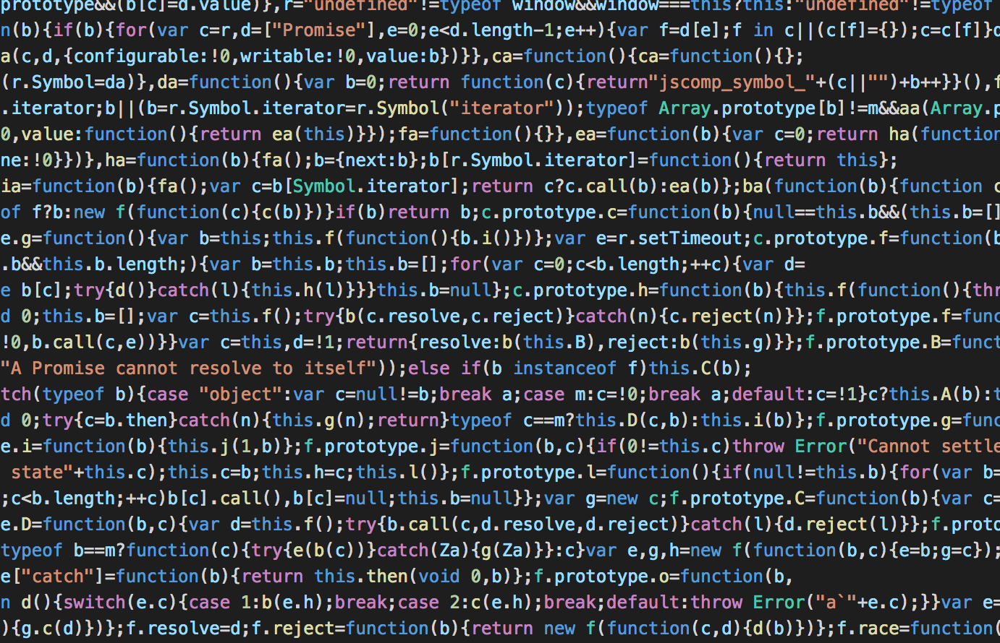
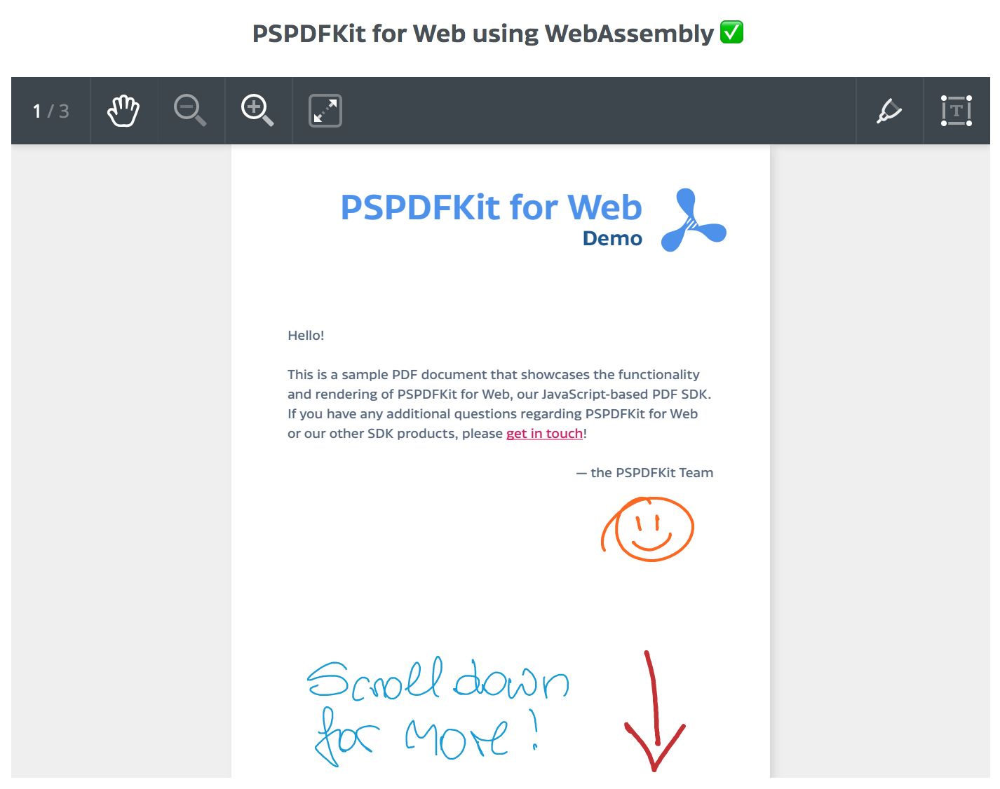
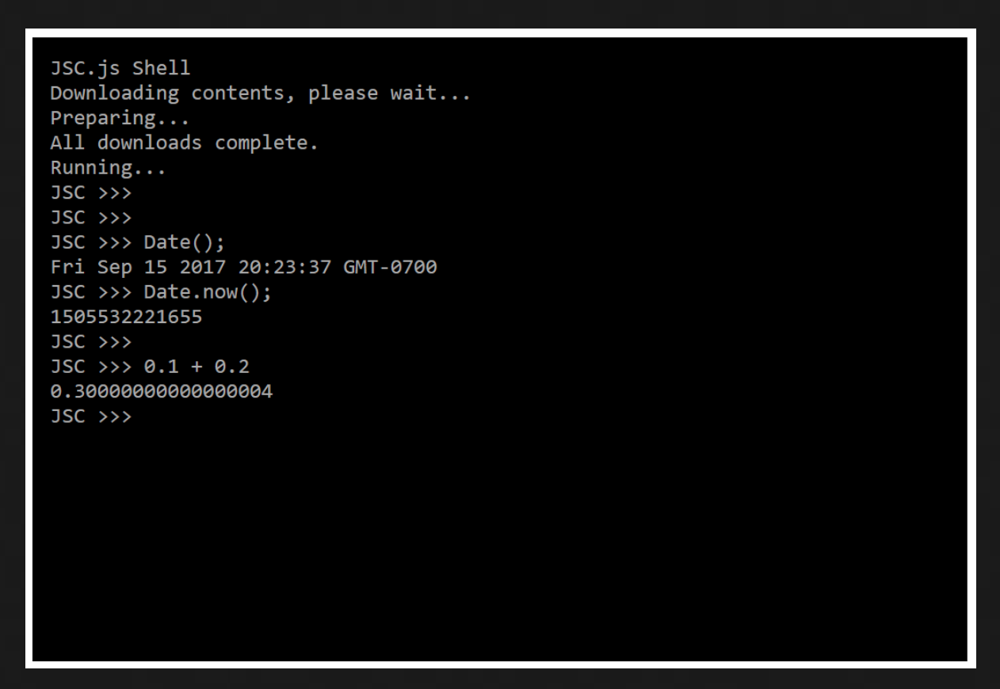
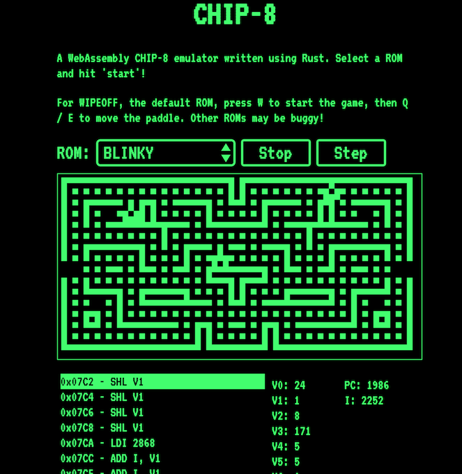
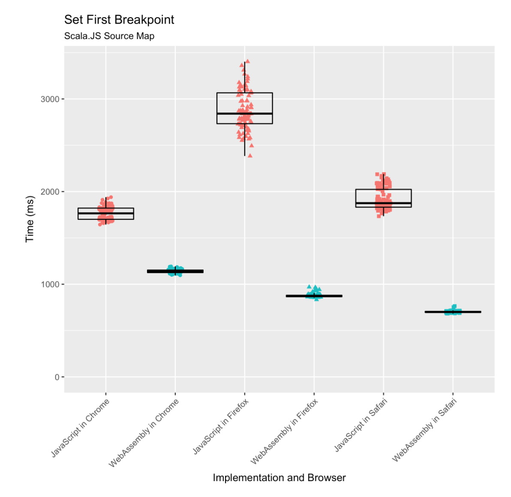

layout: true

---
class: center, middle, chapter

# WebAssembly
## and the death of JavaScript?
• • •
## Colin Eberhardt, Scott Logic


---
class: center, middle, chapter

# A brief history of the web

---
class: center, middle

# JavaScript
## (created in 10 days in May 1995, by Brendan Eich)

---
class: center, middle

# Java Applets

---
class: center, middle

# ActiveX

---
class: center, middle

# Flash

---
class: center, middle

# Silverlight

---
class: center, middle

# Dart

---
class: center, middle

# 2018 - JavaScript (still!)
## ... but the way we are using it has changed

---
class: center, middle

# We are writing a *lot* of JavaScript

```console
$ npx create-react-app my-app
$ cd my-app
$ find . -name '*.js' | xargs wc -l | tail -1
   79905 total
```

---
class: image, middle



JavaScript is the Assembly Language of the Web

---
class: center, middle

# JavaScript isn't a very good Assembly Language!

---
class: image, middle


https://blog.mozilla.org/luke/2014/01/14/asm-js-aot-compilation-and-startup-performance/

---
class: image, middle

What does JavaScript execution look like today?


https://hacks.mozilla.org/2017/02/a-cartoon-intro-to-webassembly/

---
class: center, middle

> the Web has become the most ubiquitous application platform ever, and yet by historical accident the only natively supported programming language for that platform is JavaScript!

---
class: center, middle, chapter

# WebAssembly

> WebAssembly or wasm is a new portable, size- and load-time-efficient format suitable for compilation to the web.

---
class: center, middle

# asm.js

<!--
A Mozilla experiment, effectively creating a new virtual machine from JavaScript
Let's have a look at it in practice ...
-->

---

~~~c
float power(float number, int pow) {
  float res = number;
  for (int i = 0;i < pow - 1; i++) {
    res = res * number;
  }
  return res;
}
~~~

~~~
emcc power.c -O3  -s ONLY_MY_CODE=1 -s EXPORTED_FUNCTIONS="['_power']"
~~~

~~~javascript
"use asm";
function X(a, b) {
 a = +a;
 b = b | 0;
 var c = 0.0, d = 0;
 d = b + -1 | 0;
 if ((b | 0) > 1) {
  b = 0;
  c = a;
 } else return +a;
 do {
  c = c * a;
  b = b + 1 | 0;
 } while ((b | 0) != (d | 0));
 return +c;
}
~~~

---
class: image, middle

asm.js optimised execution


---
class: image, middle


---
class: center, offtop, image

# WebAssembly Roadmap

- 2015 - WebAssembly Community Group formed
- 2017 - WebAssembly MVP released
- 2018 - W3C public draft published

<br/>
<br/>


---
class: image, middle


---
class: center, middle, chapter

# WebAssembly Demo

<!--
Demo #1 - add
- Demo a simple add function written in C
- Show how it compiles to a binary format
- Quick demo of WAT - stack machine
- Modules loaded via JavaScript
- Functions exported / imported

Demo #2 - strings
- talk about the interface issue, only 4 types
-->

---
class: center, offtop

# WebAssembly Architecture

- A stack machine, 4 types, 67 instructions
- Designed to support streaming compilation
- Simple validation rules
- Exports / imports functions
- Linear memory is shared with JavaScript

---
class: center, offtop

# WebAssembly Future

- Garbage collector
- Threads
- Host bindings
- SIMD
- Exception handling
<!-- todo: find out more about host bindings -->

---
class: center, middle, chapter

# WebAssembly Language Support
## (and what people are doing with it)

---
class: center, offtop

# C / C++

- Emscripten
- Based on LLVM
- Originally used to create asm.js

---
class: image



https://pspdfkit.com/blog/2017/webassembly-a-new-hope/

---
class: image



https://mbbill.github.io/JSC.js/

---
class: image


---
class: center, offtop

# Java / C&#35;

- More challenging, these languages require a GC

--
- Blazor, experimental project, using Mono
 - Testing interpreted mode, vs. AOT (with runtime for GC etc …)
 - Blazor is an SPA framework

---
class: center, offtop

# JavaScript

- Needs a GC and isn’t statically typed

--
- “Walt is a JavaScript-like syntax for WebAssembly text format”

--
- AssemblyScript - a TypeScript to WebAssembly compiler
 - Awaiting GC before it can really become powerful

---
class: image


https://bl.ocks.org/ColinEberhardt/6ceb7ca74aabac9c8534d7120d31b382

---
class: center, offtop

# Rust

- Doesn’t require a GC
- Originally used Emscripten, but moved to a simpler toolchain

> We're poised to be THE language of choice for wasm.


---
class: image



<small>http://blog.scottlogic.com/2017/12/13/chip8-emulator-webassembly-rust.html</small>

---
class: image



https://hacks.mozilla.org/2018/01/oxidizing-source-maps-with-rust-and-webassembly/

---
class: center, middle, chapter

# Crystal Ball Gazing
# 🔮🔮🔮🔮

---
class: center, offtop

# 2018

- Rust, C, C++ used in production for performance critical, algorithmic tasks

--
- Webpack

--
- Java, C#, Typescript lots of creative experiments / POCs

--
- Native node modules

--
- GC support

---
class: center, offtop

# 2019

- Host bindings, SIMD, threading, ...

--
- Java, C&#35; become production ready

--
- Another wave of mobile, desktop and server-side UI frameworks will re-target the web
  - write once, run everywhere


--
- Performance gains fail to materialise, with backlash from early adopters


--
- Heavyweight productivity tools all start moving to the web (e.g. Photoshop, AutoCAD)


---
class: center, offset

# 2020 - and beyond

- JavaScript will compile directly to WebAssembly, `"use wasm"`

--
- Native Android apps die-out in favour of Progressive Web Apps (PWA) running on WebAssembly

--
- Windows store moves to PWA / WASM

--
- A new DOM alternative will emerge?

--
- JavaScript's monopoly will be lost, and it's popularity will fade

--
- The ubiquity of the web extends further still

---
class: center, middle, chapter

# WebAssembly
## and the death of JavaScript?
• • •
## Colin Eberhardt
